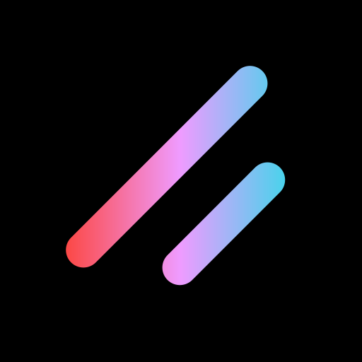

 
 <h1 align="center">
  shadcn-lynx
 </h1>

shadcn-lynx is an unofficial community-led [Lynx](https://lynxjs.org) port of [shadcn/ui](https://ui.shadcn.com/).

> **Note**   **We are not affiliated with shadcn, but this project follows the same open-source philosophy.**   This is a project born out of the need for a shadcn/ui-like experience in the Lynx ecosystem.

Accessible and customizable components that you can copy and paste into your apps. Free. Open Source. **Use this to build your own component library.**

Built on top of [@lynx-js/lynx-ui](https://github.com/lynx-family/lynx-ui) (headless primitives for Lynx) and styled with Tailwind CSS.

## Documentation

Visit https://shadcn-lynx.com/docs to view the documentation.

## License

Published under the [MIT](./LICENSE) license.
